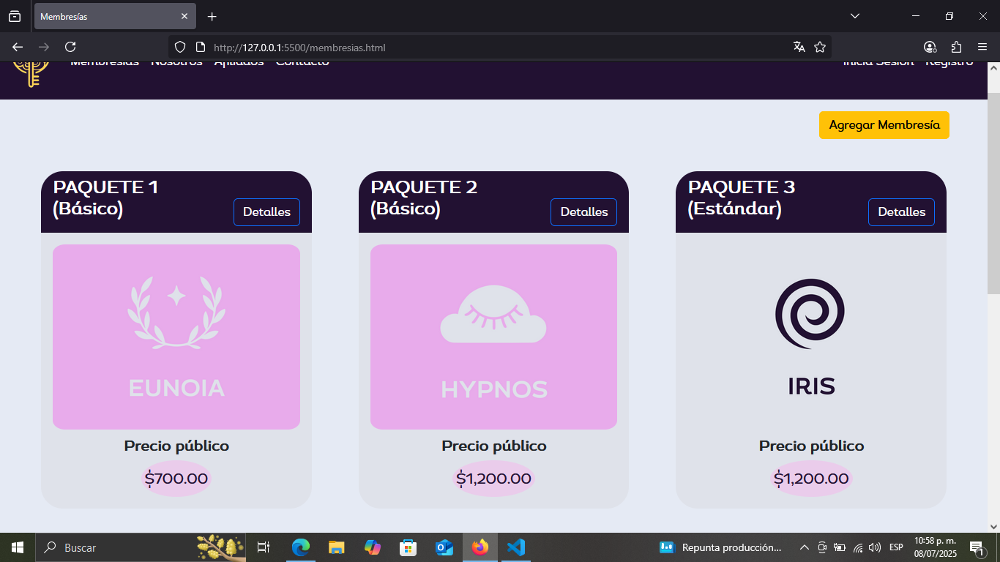

# DreamKey

DreamKey es una plataforma innovadora que ayuda a las personas a desbloquear su potencial, organizar sus metas y convertir sus sueños en logros tangibles. Ofrece herramientas inteligentes para el seguimiento, análisis y motivación, todo en una interfaz intuitiva pensada para inspirar y facilitar el crecimiento personal

## ✨ Características

- Creado en HTML,JavaScript,CSS.
- Backend en Java.
- Base de datos en MySQL.
- Subido a la red con AWS CLI.
- FrontEnd con Bootstrap.

## 🚀 Instalación

```bash
git clone https://github.com/GREGORIO971117/dreamkey.git
cd dreamkey
# Instala las dependencias (ajusta a tu stack, por ejemplo npm install, pip install -r requirements.txt, etc)
npm install
```
## 📸 Capturas de Pantalla

<!-- Agrega imágenes/gifs aquí para mostrar cómo luce tu proyecto -->
.



## 📝 Licencia

Este proyecto está bajo la licencia [MIT](LICENSE).

## 📫 Contacto

Puedes encontrarme en [LinkedIn](https://linkedin.com/in/gregoriogt9711)**

---

**Hecho con ❤️ por [GREGORIO971117](https://github.com/GREGORIO971117)**
